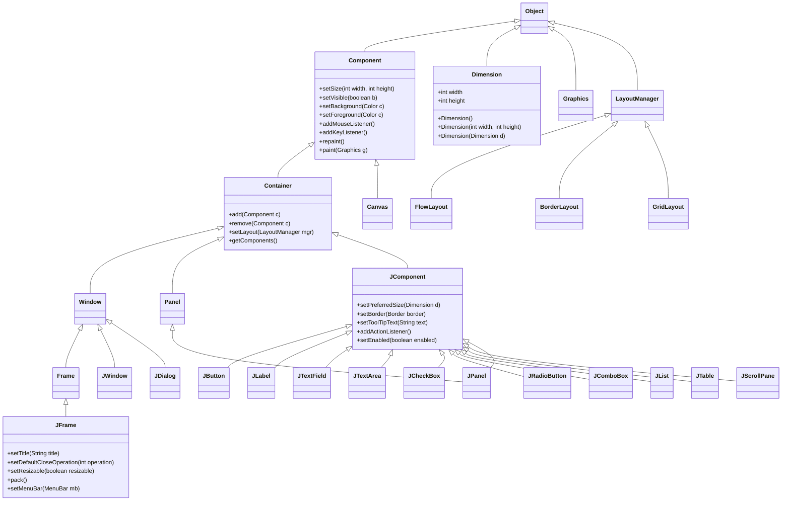

# Java GUI Classes and Their Basic Functions

## Overview

Java provides two main toolkits for creating graphical user interfaces:

- **AWT (Abstract Window Toolkit)** - `java.awt` package - heavyweight, platform-dependent components
- **Swing** - `javax.swing` package - lightweight, platform-independent components

## Core Class Hierarchy

### 1. **Component (java.awt.Component)**

Base class for all GUI elements

- `setSize(int width, int height)` - Sets component size
- `setVisible(boolean b)` - Controls visibility
- `setBackground(Color c)` - Sets background color
- `setForeground(Color c)` - Sets text/foreground color
- `addMouseListener()` - Handles mouse events
- `addKeyListener()` - Handles keyboard events
- `repaint()` - Redraws the component
- `paint(Graphics g)` - Custom drawing method

### 2. **Container (java.awt.Container)**

Extends Component, can hold other components

- `add(Component c)` - Adds a component
- `remove(Component c)` - Removes a component
- `setLayout(LayoutManager mgr)` - Sets layout manager
- `getComponents()` - Returns array of child components

### 3. **JFrame (javax.swing.JFrame)**

Main window for GUI applications

- `setTitle(String title)` - Sets window title
- `setDefaultCloseOperation(int operation)` - Sets close behavior
- `setSize(int width, int height)` - Sets window size
- `setResizable(boolean resizable)` - Controls resizing
- `pack()` - Sizes window to fit components
- `setContentPane(Container pane)` - Sets main content area
- `getContentPane()` - Gets content pane

## Swing Components (javax.swing)

### **JComponent (javax.swing.JComponent)**

Base for all Swing components

- `setPreferredSize(Dimension d)` - Sets preferred size
- `setBorder(Border border)` - Sets component border
- `setToolTipText(String text)` - Sets tooltip
- `setEnabled(boolean enabled)` - Enables/disables component

### **JPanel (javax.swing.JPanel)**

Container for grouping components

- Inherits Container and JComponent functions
- Used for organizing layouts

### **JButton (javax.swing.JButton)**

Clickable button component

- `setText(String text)` - Sets button text
- `addActionListener(ActionListener l)` - Handles clicks
- `setIcon(Icon icon)` - Sets button icon

### **JLabel (javax.swing.JLabel)**

Displays text or images

- `setText(String text)` - Sets label text
- `setIcon(Icon icon)` - Sets label icon
- `setHorizontalAlignment(int alignment)` - Sets text alignment

### **JTextField (javax.swing.JTextField)**

Single-line text input

- `getText()` - Gets entered text
- `setText(String text)` - Sets text
- `setColumns(int columns)` - Sets field width

### **Other Swing Components:**

- **JTextArea** - Multi-line text input/display
- **JCheckBox** - Checkbox for boolean input
- **JRadioButton** - Radio button for exclusive selection
- **JComboBox** - Dropdown list selection
- **JList** - Scrollable list of items

## AWT Components (java.awt)

### **Canvas (java.awt.Canvas)**

Drawing surface for custom graphics

- `paint(Graphics g)` - Override for custom drawing
- `getGraphics()` - Gets Graphics object

### **Button, Label, TextField**

AWT versions (heavyweight) with similar functions to Swing counterparts

## Helper Classes

### **Dimension (java.awt.Dimension)**

Represents width and height

- **Constructors:**
    - `Dimension()` - Creates 0x0 dimension
    - `Dimension(int width, int height)` - Creates with specified size
    - `Dimension(Dimension d)` - Copy constructor
- **Fields:** `int width`, `int height`

## Mermaid Diagram

## Class Diagram

Comprehensive Java GUI Classes Hierarchy and Relationships

## Simple GUI Application Example
![[SimpleGUIApp.java]]
Here's a complete example demonstrating these classes:

## Key Relationships

1. **Inheritance:** JFrame → Frame → Window → Container → Component
2. **Composition:** JFrame contains JPanel, JPanel contains other JComponents
3. **Helper:** Dimension used by components for size specification
4. **Event Handling:** Components use ActionListener, MouseListener, etc.
5. **Layout:** LayoutManager arranges components in containers

## Layout Managers

- **FlowLayout** - Left-to-right flow
- **BorderLayout** - North, South, East, West, Center regions
- **GridLayout** - Grid of rows and columns
- **GridBagLayout** - Flexible grid layout

This hierarchy allows for building complex GUI applications by combining containers and components with proper event handling and layout management.
[^1][^10][^11][^12][^13][^14][^15][^16][^17][^18][^19][^2][^20][^21][^3][^4][^5][^6][^7][^8][^9]

⁂

